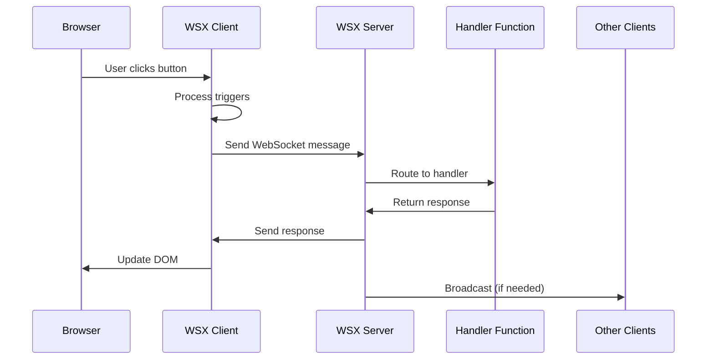

## Overview

WSX is designed with a modular architecture that separates concerns and enables easy integration with different frameworks. This document explains the core components and how they work together.

## Core Components


### WSX Client

The browser-side JavaScript library that handles:
- WebSocket connection management
- DOM event listening and processing
- HTML swapping and updates
- Reconnection logic
- Trigger processing (throttling, debouncing, etc.)

### WSX Server

The Node.js server component that manages:
- WebSocket connections
- Request routing and handling
- Response generation
- Broadcasting to clients
- Connection lifecycle management

### WSX Adapter

Framework-specific adapters that provide:
- WebSocket server setup
- Framework integration
- Request/response handling
- Connection management hooks

## Request Flow

Here's how a typical WSX request flows through the system:



## Component Details

### WSX Client Architecture

The client is built around several key classes:

#### WSX Main Class
- Manages WebSocket connection
- Handles reconnection logic
- Processes incoming messages
- Manages pending requests

#### Event System
- Listens for DOM events
- Processes trigger specifications
- Handles modifier logic (throttle, debounce, etc.)
- Manages element state

#### Swap Engine
- Parses swap specifications
- Handles DOM manipulation
- Manages timing and animation
- Processes out-of-band updates

### WSX Server Architecture

The server uses a clean, event-driven architecture:

#### WSXServer Class
- Central connection manager
- Handler registration and routing
- Broadcasting capabilities
- Connection lifecycle management

#### Connection Management
- Each WebSocket connection is wrapped in a `WSXConnection` object
- Connections are tracked in a Map for efficient lookup
- Session data can be attached to connections

#### Handler System
- Handlers are registered with names or as catch-all functions
- Handlers receive request and connection objects
- Handlers can return single responses or arrays

### Adapter System

Adapters provide framework-specific integration:

#### Express Adapter
```javascript
class ExpressAdapter implements WSXServerAdapter {
  setupWebSocket(path, onMessage) {
    // Sets up WebSocket server with Express
  }
  
  getApp() {
    // Returns Express app instance
  }
}
```

#### Hono Adapter
```javascript
class HonoAdapter implements WSXServerAdapter {
  setupWebSocket(path, onMessage) {
    // Sets up WebSocket with Hono
  }
  
  getApp() {
    // Returns Hono app instance
  }
}
```

## Data Flow

### Request Processing

1. **Client Event**: User interacts with an element that has WSX attributes
2. **Trigger Processing**: Client evaluates trigger conditions and modifiers
3. **Request Construction**: Client builds a WSXRequest object
4. **WebSocket Send**: Request is serialized and sent over WebSocket
5. **Server Routing**: Server routes request to appropriate handler
6. **Handler Execution**: Handler processes request and returns response
7. **Response Processing**: Server processes response and sends back to client(s)
8. **DOM Update**: Client applies response to DOM using swap specifications

### Broadcasting

WSX supports several broadcasting patterns:

#### Broadcast to All
```javascript
wsx.broadcast('#status', '<div>Server updated</div>');
```

#### Send to Specific Connection
```javascript
wsx.sendToConnection(connectionId, '#notification', '<div>Personal message</div>');
```

#### Out-of-Band Updates
```javascript
return {
  id: request.id,
  target: request.target,
  html: '<div>Main content</div>',
  oob: [
    { target: '#sidebar', html: '<div>Sidebar update</div>' },
    { target: '#header', html: '<div>Header update</div>' }
  ]
};
```

## Security Considerations

### Connection Security
- All WebSocket connections are validated
- Connection IDs are generated securely
- Session data is isolated per connection

### Input Validation
- All client requests should be validated on the server
- HTML content should be sanitized when necessary
- Rate limiting can be implemented at the handler level

### CORS and Origins
- WebSocket connections respect same-origin policies
- Configure allowed origins in production environments
- Use secure WebSocket (wss://) in production

## Performance Characteristics

### Client Performance
- Minimal JavaScript footprint (~15KB gzipped)
- Efficient DOM manipulation
- Smart reconnection logic
- Optimized event handling

### Server Performance
- Lightweight connection management
- Fast request routing
- Efficient broadcasting
- Minimal memory footprint per connection

### Scalability
- Horizontal scaling through load balancing
- Connection state is per-server instance
- Broadcasting can be extended with Redis/message queues

## Extension Points

### Custom Adapters
Create adapters for other frameworks:

```javascript
class CustomAdapter implements WSXServerAdapter {
  setupWebSocket(path, onMessage) {
    // Your WebSocket setup
  }
  
  getApp() {
    // Return your framework's app instance
  }
}
```

### Middleware
Add middleware to the request pipeline:

```javascript
wsx.use((request, connection, next) => {
  // Authentication, logging, etc.
  return next();
});
```

### Custom Triggers
Extend the client with custom trigger types:

```javascript
WSX.addTrigger('custom', (element, trigger, event) => {
  // Custom trigger logic
});
```

## Best Practices

### Architecture Patterns

1. **Handler Organization**: Group related handlers logically
2. **State Management**: Use connection session data for user state
3. **Error Handling**: Implement comprehensive error handling
4. **Broadcasting Strategy**: Use targeted broadcasting when possible

### Performance Optimization

1. **Connection Pooling**: Reuse connections efficiently
2. **Response Caching**: Cache responses when appropriate
3. **Batch Updates**: Use out-of-band updates for multiple DOM changes
4. **Resource Cleanup**: Properly clean up connections and timers

### Security Hardening

1. **Input Validation**: Validate all client inputs
2. **Rate Limiting**: Implement per-connection rate limits
3. **Content Security**: Sanitize HTML content
4. **Authentication**: Implement proper authentication flows

## Next Steps

Now that you understand WSX's architecture, explore:

<CardGroup cols={2}>
  <Card
    title="Connection Management"
    icon="link"
    href="/concepts/connections"
  >
    Learn about managing WebSocket connections
  </Card>
  <Card
    title="Handler System"
    icon="code"
    href="/concepts/handlers"
  >
    Understand how request handlers work
  </Card>
  <Card
    title="Custom Adapters"
    icon="plug"
    href="/frameworks/custom-adapter"
  >
    Build adapters for other frameworks
  </Card>
  <Card
    title="Performance Guide"
    icon="gauge"
    href="/advanced/performance"
  >
    Optimize your WSX applications
  </Card>
</CardGroup>